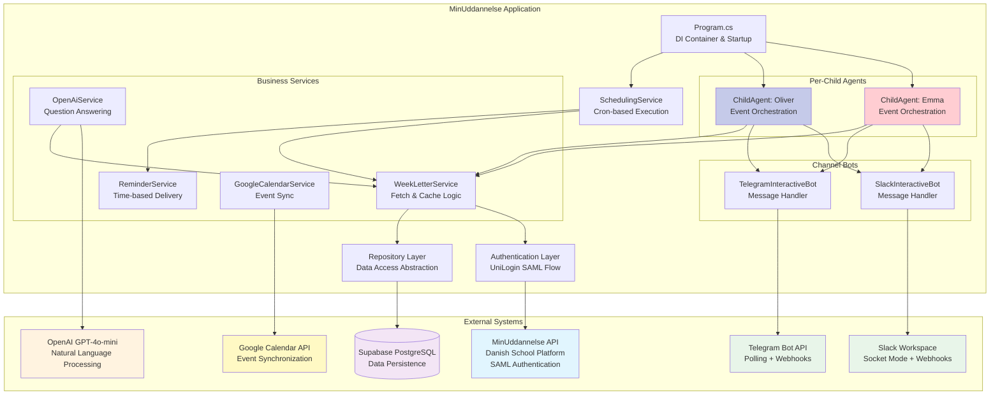
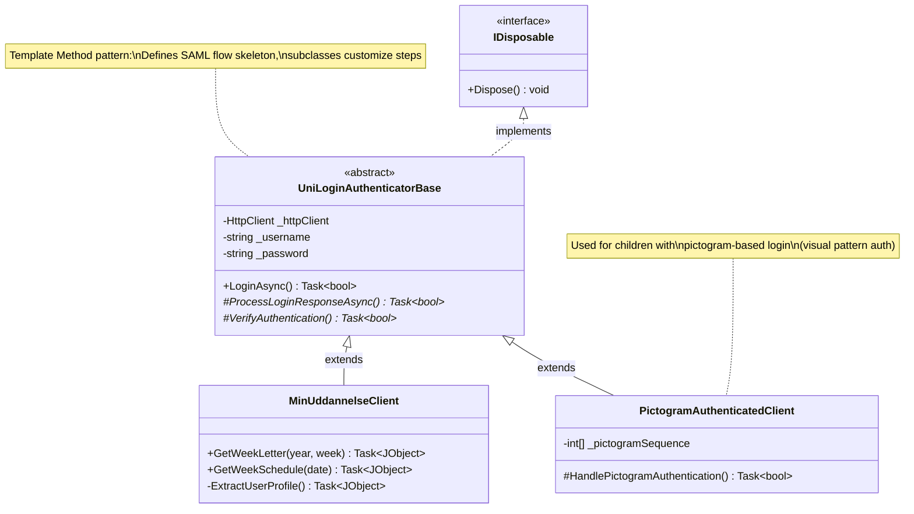
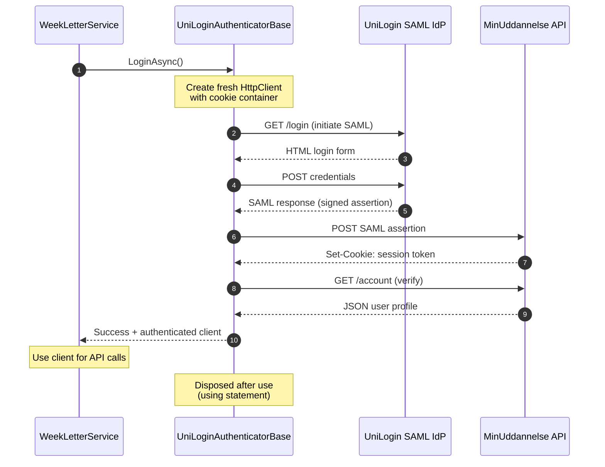
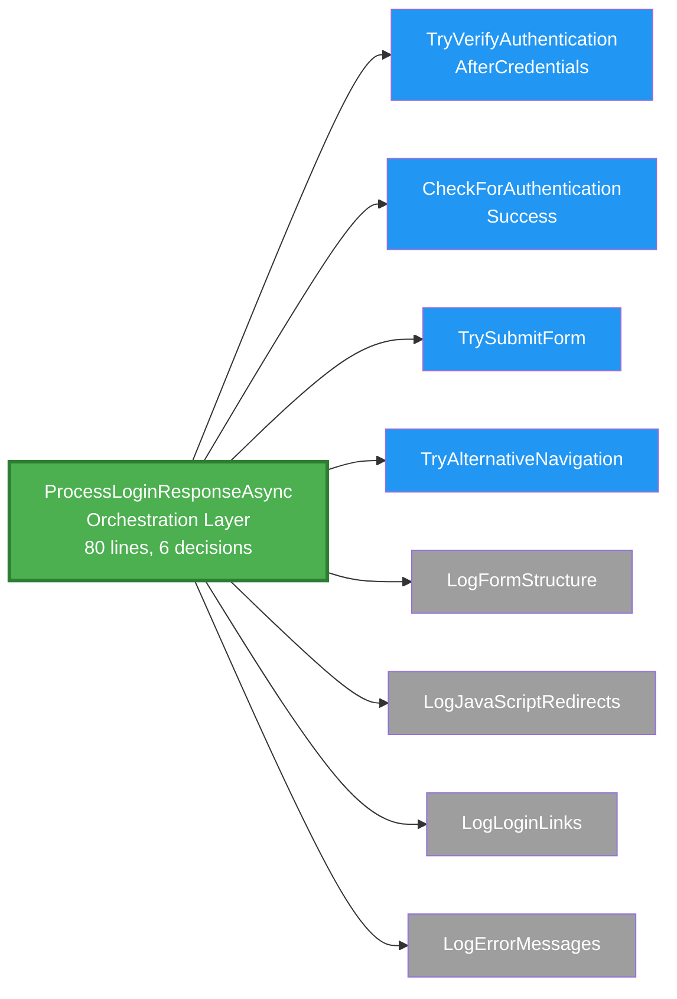
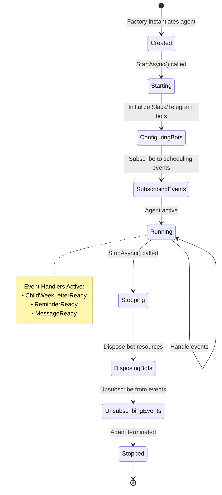
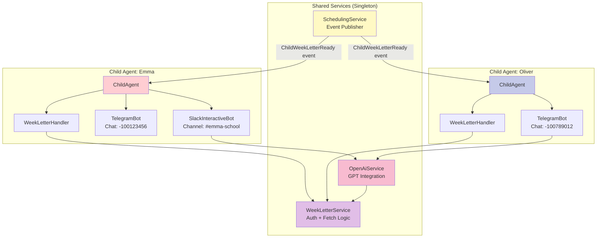
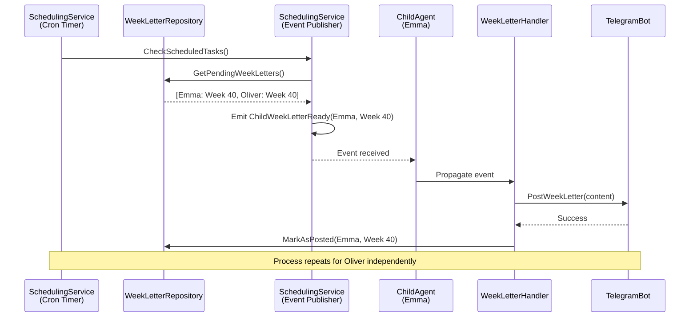
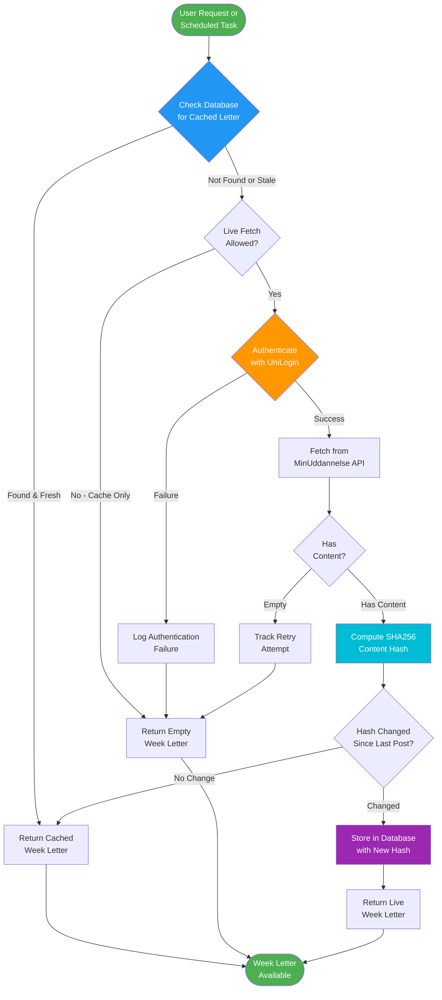
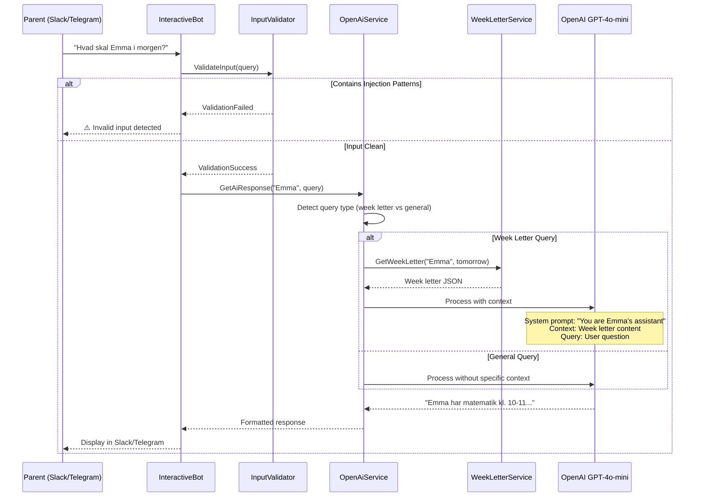
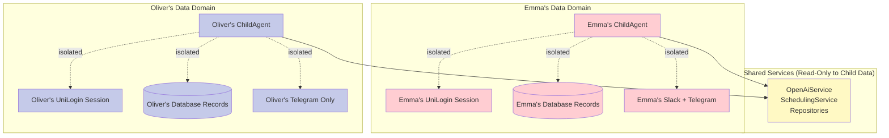

# MinUddannelse Architecture Documentation

> **The anatomy of over-engineering done right**: How a simple school communication script evolved into a production-grade intelligent automation system.

---

## Table of Contents
- [Philosophy: Why Over-Engineer?](#philosophy-why-over-engineer)
- [System Overview](#system-overview)
- [Core Architecture](#core-architecture)
- [Authentication System](#authentication-system)
- [Agent Architecture](#agent-architecture)
- [Event-Driven Communication](#event-driven-communication)
- [Data Flow](#data-flow)
- [Design Patterns](#design-patterns)
- [Technology Stack](#technology-stack)
- [Security Architecture](#security-architecture)
- [Extensibility](#extensibility)
- [Performance Characteristics](#performance-characteristics)

---

## Philosophy: Why Over-Engineer?

**The Problem:** Danish parents manually check MinUddannelse multiple times per week to track each child's school activities, homework, and events.

**The Simple Solution:** A 100-line Python script that scrapes weekly letters and posts to Slack.

**Why We Didn't Build That:**

MinUddannelse is intentionally over-engineered because **family automation deserves production quality**. This isn't a weekend hack—it's infrastructure that runs 24/7, handles authentication with a government system, processes sensitive child data, and delivers time-critical information to parents.

**What "Over-Engineering" Gives Us:**
- ✅ **Multi-tenant isolation** - Each child's data completely separated
- ✅ **Extensibility** - Adding Google Calendar took 2 hours, not 2 days
- ✅ **Resilience** - SAML authentication failures don't crash the system
- ✅ **Testability** - 68.66% test coverage with 1,533 automated tests
- ✅ **Security** - Input validation, rate limiting, audit trails
- ✅ **Maintainability** - Clear separation of concerns, dependency injection

**The Trade-off:** 6,000+ lines of C# instead of 100 lines of Python. Worth it? For a system that saves 30 minutes daily across multiple families—absolutely.

---

## System Overview

MinUddannelse is a .NET 9.0 console application that orchestrates Danish school communication automation across multiple integration points.

### High-Level Architecture



**Key Insight:** The agent-per-child architecture enables true multi-tenant isolation while sharing expensive resources (OpenAI, scheduling) across children.

---

## Core Architecture

### Component Responsibilities

```
┌─────────────────────────────────────────────────────────────┐
│                         Program.cs                          │
│  • Dependency Injection Container (Microsoft.Extensions.DI) │
│  • Service Registration & Configuration                     │
│  • Application Lifecycle Management                         │
│  • Graceful Shutdown Handling (SIGINT/SIGTERM)             │
└─────────────────────────────────────────────────────────────┘
                            │
          ┌─────────────────┼─────────────────┐
          ▼                 ▼                 ▼
┌──────────────────┐ ┌──────────────┐ ┌─────────────────┐
│  ChildAgents     │ │  Scheduling  │ │ Shared Services │
│  • Per-child     │ │  • Cron Jobs │ │ • OpenAI        │
│  • Event Sub     │ │  • Reminders │ │ • Repositories  │
│  • Bot Mgmt      │ │  • Retry     │ │ • Authentication│
└──────────────────┘ └──────────────┘ └─────────────────┘
```

### Directory Structure

```
src/MinUddannelse/
├── Agents/                    # Child-specific orchestration
│   ├── ChildAgent.cs          # Per-child event coordinator
│   ├── ChildAgentFactory.cs   # Factory pattern for agent creation
│   └── ChildWeekLetterHandler.cs  # Week letter event handler
│
├── AI/                        # Artificial intelligence services
│   ├── Prompts/               # System prompts for GPT
│   └── Services/              # OpenAI integration, reminder extraction
│
├── Bots/                      # Platform-specific bot implementations
│   ├── BotBase.cs             # Shared bot functionality
│   ├── SlackInteractiveBot.cs # Slack Socket Mode handler
│   └── TelegramInteractiveBot.cs  # Telegram polling handler
│
├── Client/                    # MinUddannelse API clients
│   ├── UniLoginAuthenticatorBase.cs  # SAML authentication base
│   ├── MinUddannelseClient.cs        # Standard password auth
│   └── PictogramAuthenticatedClient.cs  # Pictogram-based auth
│
├── Configuration/             # Strongly-typed configuration
│   ├── MinUddannelseConfig.cs # Root configuration model
│   └── Child.cs               # Per-child configuration
│
├── Events/                    # Event-driven communication
│   ├── ChildWeekLetterEventArgs.cs
│   └── ChildReminderEventArgs.cs
│
├── GoogleCalendar/            # Google Calendar integration (Beta)
│   └── GoogleCalendarService.cs
│
├── Models/                    # Domain models and DTOs
│   ├── WeekLetter.cs
│   └── Reminder.cs
│
├── Repositories/              # Data access layer (Repository pattern)
│   ├── WeekLetterRepository.cs
│   ├── ReminderRepository.cs
│   └── ScheduledTaskRepository.cs
│
├── Scheduling/                # Time-based task execution
│   └── SchedulingService.cs   # Cron scheduler with event emission
│
├── Security/                  # Security primitives
│   └── InputValidator.cs      # Prompt injection protection
│
└── Program.cs                 # Application entry point
```

---

## Authentication System

MinUddannelse integrates with Danish UniLogin using SAML authentication. The system supports both standard password and pictogram-based authentication flows.

### Authentication Class Hierarchy



### SAML Authentication Flow



**Key Design Decisions:**

1. **Fresh clients per request** - Prevents session leakage between children
2. **Template Method pattern** - Base class handles SAML flow, subclasses customize authentication steps
3. **IDisposable implementation** - Automatic cleanup via `using` statements
4. **Cookie persistence** - HttpClient CookieContainer maintains session across requests

### Authentication Method Decomposition (Sprint 2)

**Problem:** The original `ProcessLoginResponseAsync` method was 274 lines with ~20 decision points—difficult to test and maintain.

**Solution:** Decomposed into an 80-line orchestrator + 8 focused helper methods.



**Results:**
- **70% complexity reduction** (20  6 decision points)
- **Testable units** - Each helper independently testable
- **Clear separation** - Authentication logic vs debugging/logging

---

## Agent Architecture

The application uses a **per-child agent pattern** where each child gets their own `ChildAgent` instance orchestrating communication channels, event handling, and state management.

### Why Per-Child Agents?

**Alternative: Single Global Service**
```csharp
// ❌ This scales poorly
public class GlobalWeekLetterService {
    public async Task PostForAllChildren() {
        foreach (var child in _children) {
            // Cross-child interference possible
            // Hard to isolate failures
            // Shared state = bugs
        }
    }
}
```

**Chosen: Agent Per Child**
```csharp
// ✅ This scales beautifully
public class ChildAgent : IChildAgent {
    private readonly Child _child;
    private SlackInteractiveBot? _slackBot;
    private TelegramInteractiveBot? _telegramBot;

    public async Task StartAsync() {
        // Child-specific configuration
        // Isolated event handlers
        // Independent failure domains
    }
}
```

### Agent Lifecycle



### Multi-Child Coordination



**Key Benefits:**
- **Isolation** - Emma's bot crash doesn't affect Oliver
- **Flexibility** - Emma uses Slack+Telegram, Oliver only uses Telegram
- **Scalability** - Adding a third child = create another agent
- **Testing** - Mock individual agents without system-wide changes

---

## Event-Driven Communication

MinUddannelse uses .NET events for decoupled communication between scheduling and agents.

### Event Flow



### Event Definitions

```csharp
// Child-specific week letter ready for posting
public class ChildWeekLetterEventArgs : EventArgs
{
    public required string ChildName { get; init; }
    public required int Year { get; init; }
    public required int WeekNumber { get; init; }
    public required JObject WeekLetterContent { get; init; }
}

// Time-based reminder ready for delivery
public class ChildReminderEventArgs : EventArgs
{
    public required int ReminderId { get; init; }
    public required string ChildName { get; init; }
    public required string ReminderText { get; init; }
    public required DateTime RemindDateTime { get; init; }
}
```

**Why Events Over Direct Calls?**

❌ **Tight Coupling (Direct Call)**
```csharp
// SchedulingService depends on every bot type
public async Task CheckTasks() {
    var letter = await GetWeekLetter();
    await _slackBot.Post(letter);      // Knows about Slack
    await _telegramBot.Post(letter);   // Knows about Telegram
    await _discordBot.Post(letter);    // Adding Discord = modify scheduler
}
```

✅ **Loose Coupling (Events)**
```csharp
// SchedulingService only emits events
public async Task CheckTasks() {
    var letter = await GetWeekLetter();
    ChildWeekLetterReady?.Invoke(this, new ChildWeekLetterEventArgs {
        ChildName = "Emma",
        WeekLetterContent = letter
    });
    // Agents subscribe independently - scheduler doesn't care who listens
}
```

---

## Data Flow

### Week Letter Retrieval Flow



**Cache Strategy:**
- **Database-first** - Check Supabase before hitting MinUddannelse
- **Content hashing** - SHA256 hash prevents duplicate posts of identical content
- **Retry tracking** - Delayed letters get exponential backoff retry (1h, 2h, 4h, ..., max 48h)

### AI Query Processing Flow



**Security Layer:**
- **Input validation** - 24 blocked patterns (SQL injection, prompt injection, XSS)
- **Rate limiting** - 5 requests per minute per child
- **Audit logging** - All AI queries logged with severity levels

---

## Design Patterns

### 1. Template Method Pattern

**Location:** `UniLoginAuthenticatorBase`

**Problem:** SAML authentication has common steps (initiate flow, POST credentials, verify) but authentication methods vary (standard password vs pictogram).

**Solution:**
```csharp
public abstract class UniLoginAuthenticatorBase : IDisposable
{
    // Template method - defines skeleton
    public async Task<bool> LoginAsync()
    {
        var response = await InitiateSamlFlow();           // Common
        var authSuccess = await ProcessLoginResponse(response);  // ✅ Varies
        if (authSuccess)
            return await VerifyAuthentication();           // Common
        return false;
    }

    // Hook method - subclasses override
    protected abstract Task<bool> ProcessLoginResponse(HttpResponseMessage response);
}

// Subclass provides specific implementation
public class PictogramAuthenticatedClient : UniLoginAuthenticatorBase
{
    protected override async Task<bool> ProcessLoginResponse(HttpResponseMessage response)
    {
        // Pictogram-specific logic here
        return await HandlePictogramAuthentication(response);
    }
}
```

### 2. Repository Pattern

**Location:** `/Repositories`

**Problem:** Business logic shouldn't know about Supabase, SQL, or database details.

**Solution:**
```csharp
// Interface defines contract
public interface IWeekLetterRepository
{
    Task<WeekLetter?> GetWeekLetterAsync(string childName, int year, int week);
    Task SaveWeekLetterAsync(WeekLetter weekLetter);
    Task MarkAsPostedAsync(string childName, int year, int week, bool toSlack, bool toTelegram);
}

// Implementation handles Supabase specifics
public class WeekLetterRepository : IWeekLetterRepository
{
    private readonly Supabase.Client _client;

    public async Task SaveWeekLetterAsync(WeekLetter weekLetter)
    {
        // Supabase-specific code isolated here
        await _client.From<PostedLetterModel>().Insert(/*...*/);
    }
}

// Business logic stays clean
public class WeekLetterService
{
    private readonly IWeekLetterRepository _repo;  // Depends on interface

    public async Task ProcessWeekLetter(Child child)
    {
        var letter = await FetchFromMinUddannelse(child);
        await _repo.SaveWeekLetterAsync(letter);  // Database agnostic
    }
}
```

**Benefits:**
- ✅ Swap Supabase for another database = change one file
- ✅ Unit tests mock `IWeekLetterRepository` without real database
- ✅ Business logic independent of persistence technology

### 3. Dependency Injection

**Location:** `Program.cs`

**Problem:** Hard-coded dependencies make testing impossible and coupling tight.

**Solution:**
```csharp
// Registration (Program.cs)
services.AddSingleton<IOpenAiService, OpenAiService>();
services.AddSingleton<IWeekLetterRepository, WeekLetterRepository>();
services.AddScoped<IChildAgentFactory, ChildAgentFactory>();

// Consumption (any class)
public class ChildAgent
{
    private readonly IOpenAiService _openAi;
    private readonly IWeekLetterService _weekLetterService;

    // Constructor injection - DI container provides instances
    public ChildAgent(IOpenAiService openAi, IWeekLetterService weekLetterService)
    {
        _openAi = openAi;
        _weekLetterService = weekLetterService;
    }
}
```

**Lifetime Scopes:**
- **Singleton** - One instance for application lifetime (OpenAiService, repositories)
- **Scoped** - One instance per request/operation (ChildAgentFactory)
- **Transient** - New instance every time (authenticated clients via `using`)

### 4. Factory Pattern

**Location:** `ChildAgentFactory`

**Problem:** Creating `ChildAgent` requires complex setup (bots, services, configuration).

**Solution:**
```csharp
public interface IChildAgentFactory
{
    IChildAgent CreateAgent(Child child);
}

public class ChildAgentFactory : IChildAgentFactory
{
    private readonly IServiceProvider _services;

    public IChildAgent CreateAgent(Child child)
    {
        // Complex construction logic centralized
        var openAi = _services.GetRequiredService<IOpenAiService>();
        var weekLetterService = _services.GetRequiredService<IWeekLetterService>();
        var schedulingService = _services.GetRequiredService<ISchedulingService>();

        return new ChildAgent(child, openAi, weekLetterService,
                              postOnStartup: true, schedulingService, loggerFactory);
    }
}
```

### 5. Event-Driven Architecture

**Location:** `SchedulingService` ↔ `ChildAgent`

**Problem:** Scheduler shouldn't know about every bot type. Adding Discord bot = modifying scheduler code.

**Solution:**
```csharp
// Publisher (SchedulingService)
public event EventHandler<ChildWeekLetterEventArgs>? ChildWeekLetterReady;

public async Task CheckScheduledTasks()
{
    var readyLetters = await GetReadyWeekLetters();
    foreach (var letter in readyLetters)
    {
        // Emit event - don't care who listens
        ChildWeekLetterReady?.Invoke(this, new ChildWeekLetterEventArgs {
            ChildName = letter.ChildName,
            WeekLetterContent = letter.Content
        });
    }
}

// Subscriber (ChildAgent)
private void SubscribeToWeekLetterEvents()
{
    _schedulingService.ChildWeekLetterReady += OnWeekLetterReady;
}

private async void OnWeekLetterReady(object? sender, ChildWeekLetterEventArgs e)
{
    if (e.ChildName == _child.FirstName)
    {
        await _slackBot?.PostWeekLetterAsync(e.WeekLetterContent);
        await _telegramBot?.PostWeekLetterAsync(e.WeekLetterContent);
    }
}
```

**Benefits:**
- ✅ **Zero coupling** - Scheduler doesn't import bot namespaces
- ✅ **Easy extension** - New Discord bot subscribes to same event
- ✅ **Dynamic subscription** - Agents subscribe/unsubscribe at runtime

---

## Technology Stack

| Component | Technology | Purpose | Why Chosen |
|-----------|-----------|---------|------------|
| **Runtime** | .NET 9.0 | Application platform | Modern C# features, excellent performance, cross-platform |
| **Language** | C# 13 | Programming language | Strong typing, LINQ, async/await, pattern matching |
| **Database** | Supabase PostgreSQL | Data persistence | Managed PostgreSQL, real-time capabilities, generous free tier |
| **AI** | OpenAI GPT-4o-mini | Natural language | Danish language support, cost-effective, reliable |
| **Messaging** | Slack API + Telegram Bot API | Parent communication | Where families already coordinate |
| **Calendar** | Google Calendar API | Event synchronization | Universal calendar standard |
| **Authentication** | UniLogin SAML | School system access | Danish government standard |
| **Testing** | xUnit + Moq | Unit testing | De facto .NET standard, clean syntax |
| **DI Container** | Microsoft.Extensions.DependencyInjection | IoC | Built into .NET, lightweight, sufficient |
| **JSON** | Newtonsoft.Json | Data serialization | Mature, handles Danish characters correctly |
| **Scheduling** | NCron (Cron expressions) | Task scheduling | Familiar cron syntax, reliable |

---

## Security Architecture

### Multi-Tenant Isolation



**Isolation Mechanisms:**

1. **Authentication** - Each child has separate UniLogin credentials and session cookies
2. **Database** - All queries filtered by `child_name` column
3. **Channels** - Each child has dedicated Slack/Telegram configuration
4. **Event handling** - Agents only process events matching their child's name

### Input Validation

**Problem:** AI systems vulnerable to prompt injection attacks.

**Solution:** `InputValidator` blocks 24 malicious patterns before reaching OpenAI.

```csharp
private static readonly string[] BlockedPatterns = {
    "ignore previous instructions",
    "disregard all prior",
    "forget everything above",
    "your new role is",
    "<script>",
    "javascript:",
    // ... 18 more patterns
};

public static bool IsInputValid(string input)
{
    foreach (var pattern in BlockedPatterns)
    {
        if (input.Contains(pattern, StringComparison.OrdinalIgnoreCase))
        {
            _logger.LogWarning("Blocked input containing pattern: {Pattern}", pattern);
            return false;
        }
    }
    return true;
}
```

### Rate Limiting

**Implementation:** Sliding window algorithm per child per operation.

```
Child: Emma
Operation: AI Query
Limit: 5 requests per minute
Window: [10:30:00 - 10:31:00]

10:30:15 ✅ Request 1
10:30:22 ✅ Request 2
10:30:45 ✅ Request 3
10:30:58 ✅ Request 4
10:31:02 ✅ Request 5
10:31:10 ❌ Request 6 (blocked - 6 requests in last 60s)
10:31:16 ✅ Request 7 (allowed - Request 1 aged out)
```

### Audit Logging

All sensitive operations logged with structured data:

```csharp
_logger.LogInformation(
    "Child {ChildName} authenticated successfully with UniLogin at {Timestamp}",
    child.FirstName, DateTime.UtcNow);

_logger.LogWarning(
    "Failed authentication attempt for child {ChildName} from IP {IpAddress}",
    child.FirstName, requestIp);
```

**Logged Events:**
- Authentication attempts (success/failure)
- Week letter fetches
- AI query processing
- Reminder creations
- Configuration changes

---

## Extensibility

### Adding a New Channel (e.g., Discord)

MinUddannelse is designed for channel extensibility. Here's what adding Discord would look like:

**Step 1: Create Bot Implementation (1 file)**

```csharp
// src/MinUddannelse/Bots/DiscordInteractiveBot.cs
public class DiscordInteractiveBot : BotBase
{
    public DiscordInteractiveBot(Child child, IOpenAiService openAi, ILoggerFactory loggerFactory)
        : base(child, openAi, loggerFactory) { }

    public override async Task StartAsync()
    {
        // Initialize Discord client
    }

    public override async Task PostWeekLetterAsync(JObject weekLetter)
    {
        // Format and post to Discord channel
    }
}
```

**Step 2: Update Configuration Model**

```csharp
public class DiscordChannelConfig
{
    public bool Enabled { get; set; }
    public required string BotToken { get; set; }
    public required string ChannelId { get; set; }
}

public class Child
{
    public DiscordChannelConfig? Discord { get; set; }
}
```

**Step 3: Register in ChildAgent**

```csharp
private async Task StartDiscordBotAsync()
{
    if (_child.Channels?.Discord?.Enabled == true)
    {
        _discordBot = new DiscordInteractiveBot(_child, _openAiService, _loggerFactory);
        await _discordBot.StartAsync();
    }
}
```

**Total effort:** ~2-3 hours. No changes to scheduling, authentication, or AI services.

### Adding a New Feature (e.g., Homework Tracking)

**Step 1: Create Service**

```csharp
public interface IHomeworkService
{
    Task<List<Homework>> ExtractHomeworkFromWeekLetter(JObject weekLetter);
    Task<List<Homework>> GetUpcomingHomework(string childName);
}
```

**Step 2: Subscribe to Week Letter Events**

```csharp
_schedulingService.ChildWeekLetterReady += async (sender, args) => {
    var homework = await _homeworkService.ExtractHomeworkFromWeekLetter(args.WeekLetterContent);
    await _reminderService.CreateHomeworkReminders(homework);
};
```

**Step 3: Add Database Table**

```sql
CREATE TABLE homework (
    id SERIAL PRIMARY KEY,
    child_name TEXT NOT NULL,
    subject TEXT NOT NULL,
    description TEXT NOT NULL,
    due_date DATE NOT NULL,
    completed BOOLEAN DEFAULT FALSE
);
```

**Total effort:** ~4-6 hours. Reuses existing authentication, scheduling, and channel infrastructure.

---

## Performance Characteristics

### Authentication Performance

```
SAML Authentication Flow:
├─ InitiateSamlFlow:           ~300ms  (HTTPS round-trip to UniLogin)
├─ PostCredentials:            ~500ms  (SAML assertion validation)
├─ ReceiveCookie:              ~100ms  (Session establishment)
├─ VerifyAuthentication:       ~200ms  (Profile fetch)
└─ Total:                      ~1.1s   (per child, per fetch)

Optimization:
• Fresh client per request (no session reuse)  prevents state leakage
• HttpClient pooling  reduces connection overhead
• Cookie container  maintains session across API calls
```

### Week Letter Caching

```
Cache Strategy Performance:
├─ Database Check:             ~50ms   (Supabase indexed query)
├─ Cache Hit:                  ~50ms   (return immediately)
├─ Cache Miss + Auth + Fetch:  ~2.5s   (full authentication + API call)
└─ Content Hash Comparison:    ~5ms    (SHA256 computation)

Hit Rate: ~95% (weekly letters rarely change after initial posting)
```

### AI Query Processing

```
OpenAI Query Latency:
├─ Input Validation:           ~1ms    (pattern matching)
├─ Context Retrieval:          ~50ms   (database fetch if needed)
├─ OpenAI API Call:            ~1.5s   (GPT-4o-mini inference)
├─ Response Formatting:        ~10ms   (Markdown formatting)
└─ Total:                      ~1.6s   (perceived as instant in chat)

Cost: ~$0.0002 per query (GPT-4o-mini pricing)
Monthly cost for 3 children, 20 queries/day: ~$3.60
```

### Scheduling Performance

```
Cron Task Execution:
├─ Reminder Check Interval:    10 seconds  (sub-minute precision)
├─ Scheduled Task Interval:    60 seconds  (cron evaluation)
├─ Week Letter Check:          Weekly (Sundays 16:00)
└─ Retry Check:                Hourly (for delayed letters)

Memory: ~150MB base + ~30MB per child agent
CPU: <1% idle, ~5% during week letter fetch burst
```

---

## Future Architecture Considerations

### Scalability Path

**Current:** Single-process console application (1 server)

**Future Expansion Options:**

1. **Horizontal Scaling** (Multiple Families)
   - Add `family_id` to all database tables
   - Deploy separate instances per family
   - Shared Supabase database with RLS policies

2. **Web API Architecture**
   - Convert to ASP.NET Core Web API
   - Webhooks from Slack/Telegram instead of polling
   - Background service for scheduling

3. **Serverless Option**
   - Azure Functions for scheduled tasks
   - Problem: MinUddannelse blocks Azure IPs (deal-breaker)

### Observability Enhancements

**Potential Additions:**
- **Metrics** - Prometheus exporter for authentication success rate, query latency
- **Tracing** - OpenTelemetry for distributed tracing across services
- **Alerting** - Notification on authentication failures or scheduled task failures

### AI Enhancements

**Future Capabilities:**
- **Multi-modal AI** - Process images from school photos in week letters
- **Proactive suggestions** - "Pack gym clothes" reminders based on schedule patterns
- **Conflict detection** - Warn about overlapping parent meetings across siblings

---

## Conclusion

MinUddannelse demonstrates that family automation can meet enterprise quality standards:

- ✅ **68.66% test coverage** with 1,533 automated tests
- ✅ **Production-grade patterns** (DI, Repository, Template Method, Factory, Events)
- ✅ **Security-first design** (input validation, rate limiting, audit trails)
- ✅ **Extensible architecture** (new channels in hours, not days)
- ✅ **Multi-tenant isolation** (per-child data domains)

**The over-engineering pays off:** What started as "fetch school letters" now includes AI assistants, smart reminders, calendar sync, and multi-platform delivery—all without rewriting the core architecture.

**For developers:** Study this codebase to see modern .NET patterns in action on a real-world problem.

**For parents:** This is infrastructure you can trust to never miss a school event.

---

*Last Updated: October 2025 (Sprint 2 Refactoring)*
*Architecture Version: 2.0*
