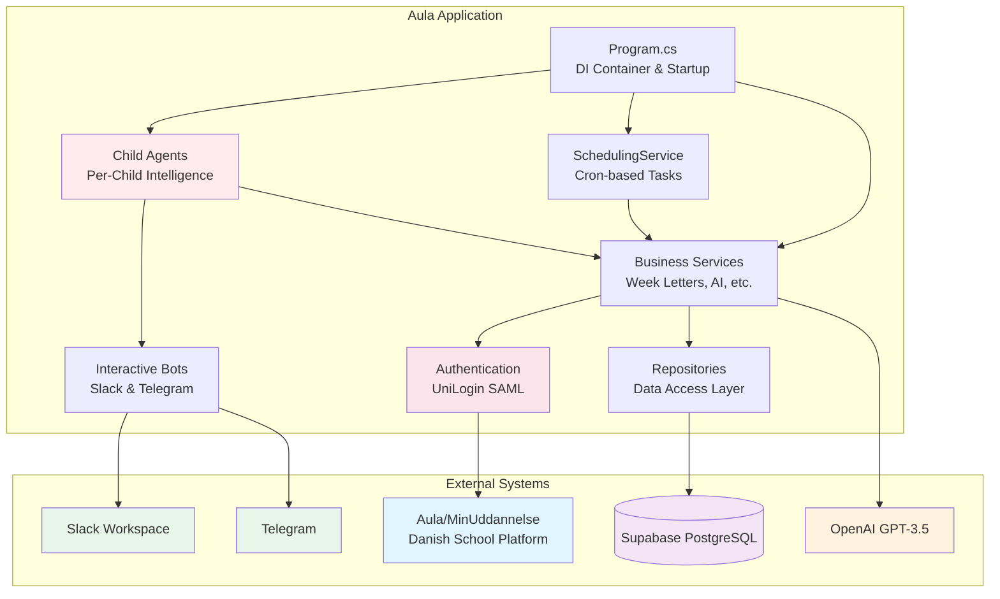
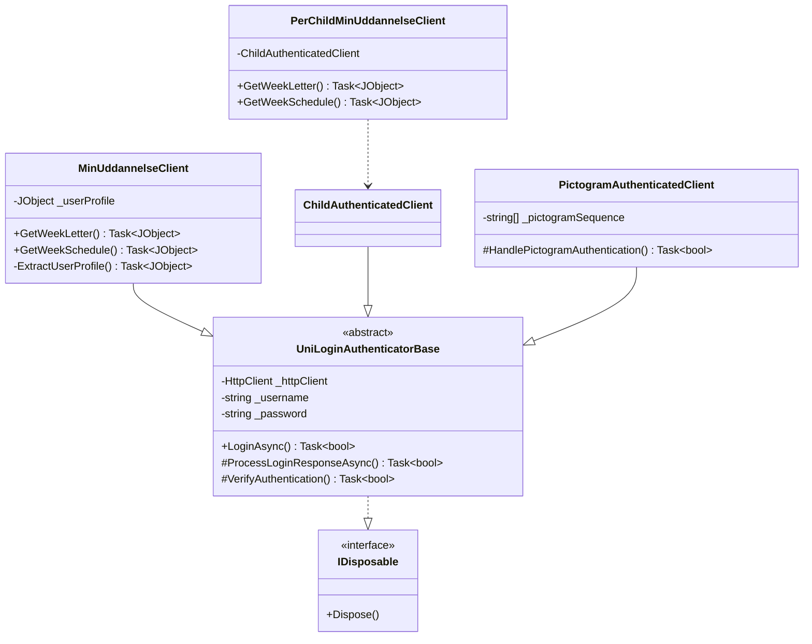
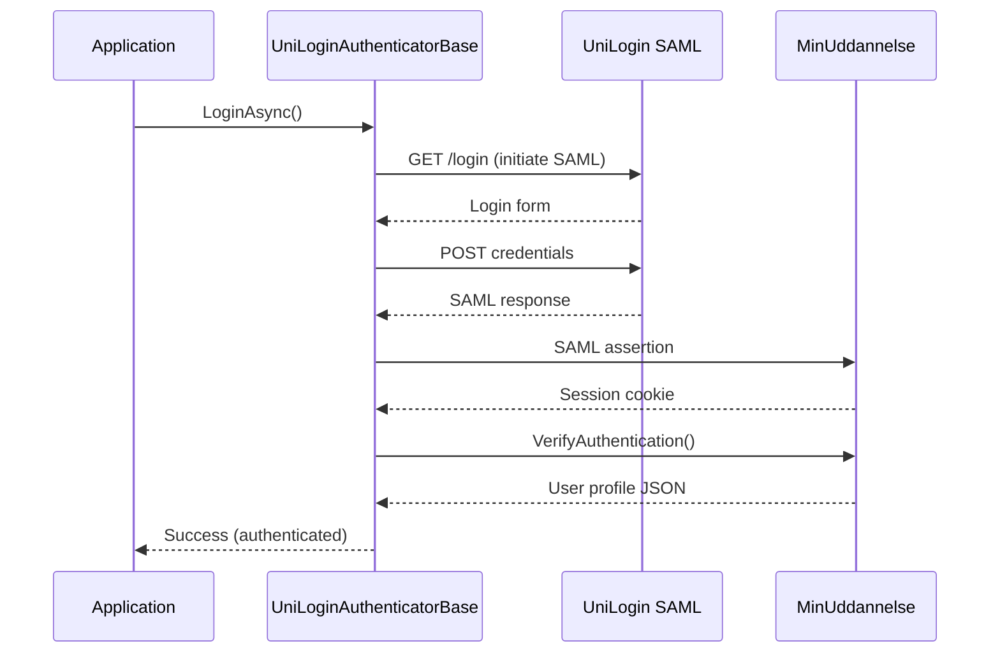
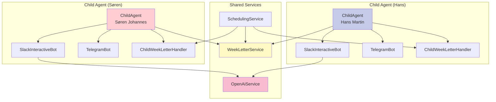
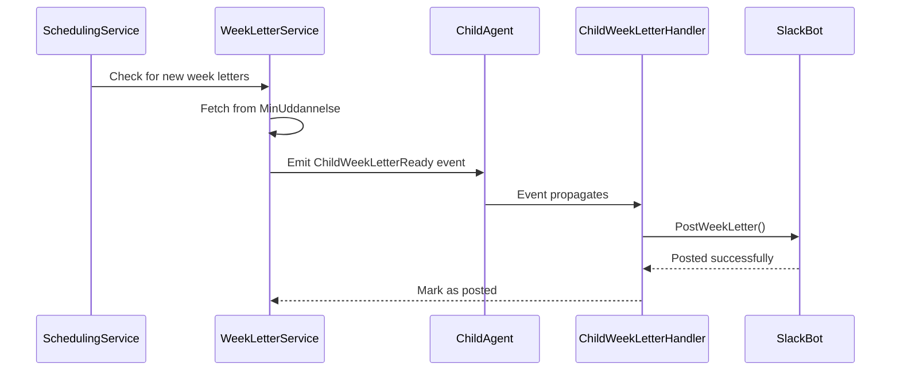
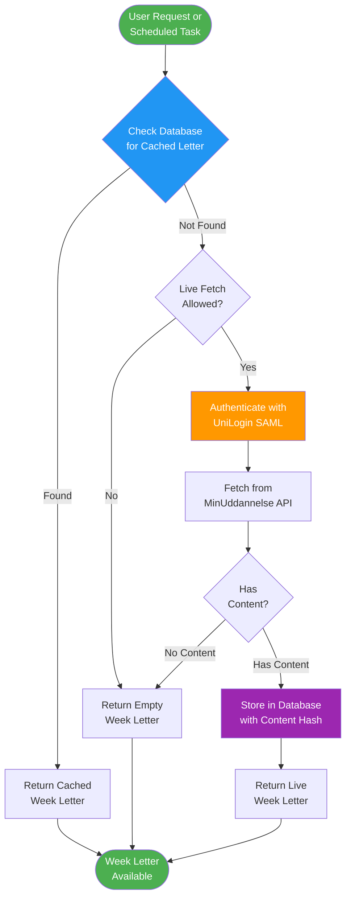
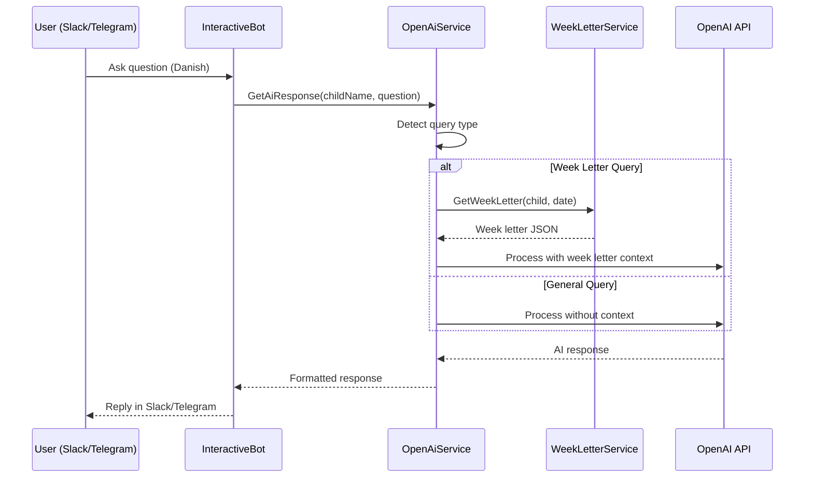

# Aula Architecture Documentation

This document provides architectural overview and diagrams for the Aula Family Assistant application.

---

## Table of Contents
- [System Overview](#system-overview)
- [Authentication Architecture](#authentication-architecture)
- [Agent Architecture](#agent-architecture)
- [Data Flow](#data-flow)
- [Key Design Patterns](#key-design-patterns)

---

## System Overview

Aula is a .NET 9.0 console application that integrates with the Danish school platform via MinUddannelse to provide automated school communication and interactive assistance for parents.



---

## Authentication Architecture

The authentication system uses SAML-based UniLogin to access MinUddannelse. After Sprint 2 refactoring, all authentication flows are unified under `UniLoginAuthenticatorBase`.

### Class Hierarchy



### SAML Authentication Flow



### Authentication Method Decomposition (Sprint 2)

After Sprint 2 refactoring, the complex 274-line `ProcessLoginResponseAsync` method was decomposed:


---

## Agent Architecture

The application uses a per-child agent architecture where each child has their own intelligent agent coordinating communication channels.

### Agent Structure



### Event-Driven Communication



---

## Data Flow

### Week Letter Retrieval Flow



### AI Query Processing Flow



---

## Key Design Patterns

### 1. Template Method Pattern
**Location**: `UniLoginAuthenticatorBase`
- Base class defines authentication flow skeleton
- Subclasses customize specific steps (e.g., pictogram handling)
- Reduces duplication while allowing customization

### 2. Repository Pattern
**Location**: `/Repositories`
- Abstracts data access behind interfaces
- Implementations: `WeekLetterRepository`, `ReminderRepository`, `ScheduledTaskRepository`
- Enables testability and separation of concerns

### 3. Dependency Injection
**Location**: `Program.cs`
- All services registered in DI container
- Constructor injection throughout
- Enables loose coupling and testability

### 4. Event-Driven Architecture
**Location**: Agent communication
- `ChildWeekLetterReady` event connects scheduling to posting
- Decouples week letter fetching from distribution
- Allows multiple handlers per event

### 5. Strategy Pattern
**Location**: Authentication methods
- `IChildAuthenticatedClient` interface
- Implementations: Standard password, Pictogram sequence
- Runtime selection based on child configuration

---

## Code Organization Principles

### Separation of Concerns

```
Integration/    ←  External API communication (MinUddannelse, UniLogin)
Services/       ←  Business logic (week letters, AI, reminders)
Repositories/   ←  Data persistence (Supabase)
Bots/           ←  Channel-specific bot implementations
Agents/         ←  Per-child orchestration and intelligence
Channels/       ←  Abstraction over Slack/Telegram
Scheduling/     ←  Time-based task execution
Utilities/      ←  Shared helper methods (Sprint 2)
```

### Testability

- ✅ 938 unit tests covering business logic
- ✅ Mocked dependencies via interfaces
- ✅ Public API testing (no reflection)
- ✅ Clear test naming conventions

---

## Recent Architectural Improvements (Sprint 2)

### Code Reduction
- **Before**: 3 duplicate authentication implementations (716 lines total)
- **After**: 1 unified `UniLoginAuthenticatorBase` (534 lines)
- **Savings**: 207 lines eliminated (-29%)

### Complexity Reduction
- **Before**: `ProcessLoginResponseAsync` - 274 lines, ~20 decision points
- **After**: Main method 80 lines + 8 helpers, ~6 decision points
- **Improvement**: 70% complexity reduction

### Utility Consolidation
- **Before**: 11 duplicate utility methods across 5 files
- **After**: `WeekLetterUtilities` static class
- **Methods**: `GetIsoWeekNumber`, `ComputeContentHash`, `CreateEmptyWeekLetter`

---

## Technology Stack

| Component | Technology | Purpose |
|-----------|-----------|---------|
| Runtime | .NET 9.0 | Application platform |
| Language | C# 13 | Modern features (generated regex, using declarations) |
| Database | Supabase PostgreSQL | Reminders, scheduling, week letters |
| AI | OpenAI GPT-3.5-turbo | Natural language processing |
| Messaging | Slack API, Telegram Bot API | Parent communication |
| Authentication | UniLogin SAML | Danish school system access |
| Testing | xUnit, Moq | Unit testing framework |
| Dependency Injection | Microsoft.Extensions.DependencyInjection | IoC container |

---

## Performance Considerations

### Authentication
- Fresh client instances per request (memory managed via `using` statements)
- Session cookies cached within HttpClient
- SAML flow typically 3-5 round trips

### Week Letters
- Database-first approach (check cache before live fetch)
- Content hash comparison prevents duplicate posts
- Retry tracking for delayed letters

### AI Queries
- Automatic context detection (week letter vs general query)
- GPT-3.5-turbo for cost efficiency
- Danish/English language detection

### Scheduling
- 10-second reminder check interval
- 1-minute scheduled task check interval
- Event-driven posting (no polling)

---

## Security Considerations

### Credentials
- Per-child UniLogin credentials in `appsettings.json`
- Pictogram sequences stored as integer arrays
- Passwords never logged (masked in debug output)

### Multi-Tenancy
- Separate agents per child
- Isolated Slack/Telegram channels per child
- No cross-child data leakage

### Disposal
- `IDisposable` implementation on authenticated clients
- `using` statements for automatic cleanup
- Prevents HttpClient leaks (Sprint 2 fix)

---

## Future Architecture Considerations

### Scalability
- Current: Single-process console application
- Future: Could be adapted to web API with webhooks
- Consideration: MinUddannelse IP blocking limits cloud deployment

### Extensibility
- Channel abstraction allows adding new platforms (Discord, WhatsApp)
- Agent architecture supports different interaction patterns
- Repository pattern enables different data stores

### Observability
- Structured logging via Microsoft.Extensions.Logging
- Metrics potential: Authentication success rates, AI query latency
- Distributed tracing potential for debugging

---

*Last Updated: October 2025 (Sprint 2 Refactoring)*
